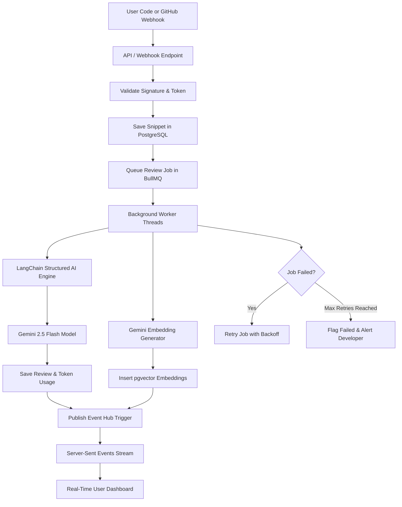

# Architecture Diagram

This diagram visualizes the asynchronous processing architecture of DevMind AI, illustrating how code changes are validated, queued, analyzed by LLM workers, indexed into vector tables, and pushed back to the client.

